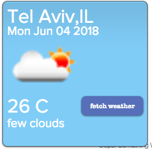

# Welcome to weather-app!

This repo is example of quick & easy way to get started writing apps using Santa platform. Santa platform is new and powerful way to implement business logic in Editor & Viewer using native components.

Before you proceed, checkout zero-to-platform-app repo and install dependencies:

```
git clone git@github.com:eranpeleg1/weatherAppWIx.git
npm i
npm run start
```

### Image


### Editor app module

The editor app creates container composed of :
Image - describing the current weather
Several texts - City, Country,Date, Temperature
Gfpp - override main actions and settings panel. The main action opens the settings panel. And the settings panel allows to
Set the city/country/geoLcation
Choosing the display Temp C/F
Set the refresh timing interval
Stage behaviour - disable the possibility to show on all page for all connected comps
Add button to make the update now and not per the interval set

### Viewer app module

Get weather data using 
https://openweathermap.org/api: 
Example for call
http://api.openweathermap.org/data/2.5/weather?q=Haifa,IL&appid=43556639500a52c1c1019b11d77b599b
The token : 43556639500a52c1c1019b11d77b599b
Update the data based on the interval
Fill relevant comp roles with relevant data
On the button click fetch the data on update 


### API
current weather: http://api.openweathermap.org/data/2.5/weather?q=Haifa,IL&appid=43556639500a52c1c1019b11d77b599b
check viewer.js to check the fields tha app use from the response

get icon: take the icon from the response above for example "01d"
https://openweathermap.org/img/w/01d.png
