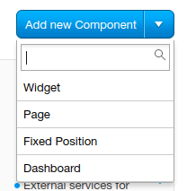

# Welcome to zero-to-platform-app!

This repo shows quick & easy way to get started writing apps using Santa platform. Santa platform is new and powerful way to implement business logic in Editor & Viewer using native components.

Before you proceed, checkout the repo and install dependencies:

```
git clone git@github.com:wix-private/zero-to-platform-app.git
npm i
npm run start
```

To see that you are up and running, go to https://localhost:3200/editor.bundle.min.js

# App registration in Dev center

To see the app running in production, you need to register it in Dev center. Visit https://dev.wix.com, click Start > Check Out Our Platform. Give a name for the app and click Register.

Note the App ID field, you will need it's value in a bit.

Scroll down to Wix Internal Fields section (you probably dont see it so read **Caveat no. 1** below) and add definition for your platform app:

```
{
    "platform": {
        "editorScriptUrl": "https:\/\/localhost:3200\/editor.bundle.min.js",
        "viewerScriptUrl": "https:\/\/localhost:3200\/viewer.bundle.min.js"
    }
}
```

Make sure the text you entered in there is valid JSON. [Here is the schema of platform app](https://github.com/wix-a/app-market-schemas/blob/master/src/main/schemas/platformApp.json) if you need additional options.

Hit Save and continue to persist your config. All done!

Note: no need to proceed the app registration beyond this point (don't submit the app)

### Caveat no. 1

Chances are that you don't see this Wix Internal Fields section:


In that case, go to #dev-center and ask for permission to access it.

### Caveat no. 2

Chances are that you cannot save the config because button is disabled. Just add a dummy widget and complain in #dev-center while you're at it.



# Seeing it in action

Create a Site from a blank template, enable Developer Tools and save it.


Go to preview. Open up console and select preview frame.


 
Make sure that app is up and running locally on the port you saved in Dev center. Paste in the following code in console:

```
documentServices.platform.provision('your-app-id')
```

Exit preview mode. Lo and behold, a controller is added to current page!


To see that your platform app is working, add a Button and an Image to the same page.


Next, select the controller and open app's settings by clicking 'Manage My First App'. A modal will open. Click Enable and close the modal. Go to preview and click the button to see the magic.

At this point you might think - well, that is one useless app. And it is! But it does show the potential of the platform and things you can do with it.

# Under the hood

So what really did happen here? The example app has created connections between controller, button and image. When you went to preview, app's viewer module queried these connections and attached `onClick` listeners to each of the connected buttons. When you clicked the button, these handlers were executed by querying all connected images and randomizing their sources.

To make any use of the platform, you'll need to understand three main components of a platform app:

1. Editor app module
2. Settings panel
3. Viewer app module

### Editor app module

It is a piece of code that is loaded by platform and runs inside a Web Worker. In this example app, we used Editor app to add the controller to stage. Also, when you clicked "Manage My First App", platform raised an event of type `controllerSettingsButtonClicked`. Editor app handled this event by opening Settings panel.

### Settings panel

The sad-looking modal is an iframe that you tell Editor to open. You can put whatever you want into the modal. It has access to platform SDK which allows you to add new components to page, create connections, persist your app configuration and much more.

### Viewer app module

This is code is also loaded by platform and runs inside a Web Worker. It adds behaviours to connected components when site is running (either Live site or in Preview mode).

### Controller

A controller is a special type of component. This controller can be connected to other components. You can query all connections to your controller and add behaviours to connected components.

In this app, a controller is created when editor app module runs. In a real world scenario, your controller would be created by Editor when users selects your app from Add Panel.

# Where to go from here

Take a look at the app [lifecycle](https://docs.google.com/document/d/1FLMReU9nRmoVXII-H1uSHzMhH6fCMHkEzPyJBGKwnsg/edit) to understand the interface and available APIs.

If you need further assistance, ask for help in #editor-platform-dev
